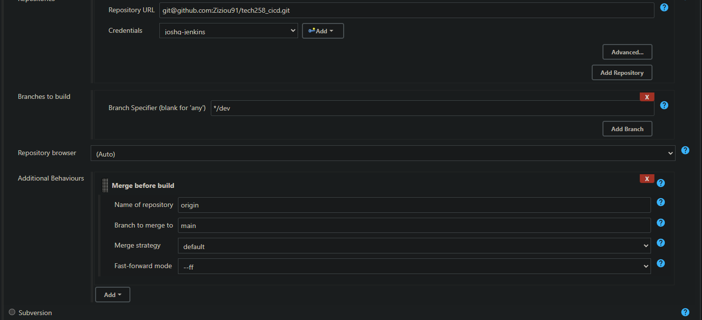
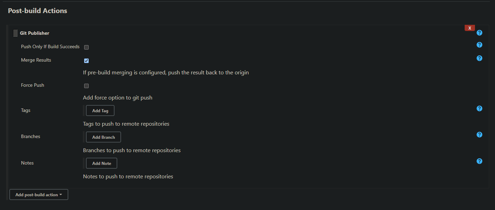
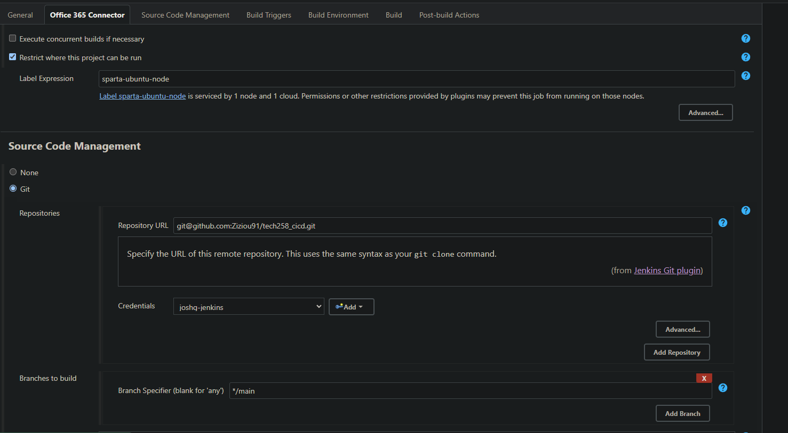

# CICD Pipelines

CI/CD pipelines are used to automate and streamline the software development lifecycle, offering numerous benefits to development teams and organizations such as:
1) **Faster time to deployment**, and in turn market - by automating the process of building, testing, and deploying software, we can enable the faster delivery updates to customers and end-users.
2) **Higher quality code** - CICD enforces best practices such as code review, comprehensive testing, and code analysis as part of the development process.
3) **Reduced Risk** - continuous delivery automates the deployment process, making releases more predictable, repeatable, and less error-prone. This reduces the risk associated with manual deployments and large, infrequent releases. 
4) **Continuous Feedback and Improvement** - CICD pipelines provide real-time feedback on the health and quality of the software through automated testing, code analysis, and deployment metrics. This feedback loop enables teams to identify areas for improvement, prioritize work effectively, and iterate rapidly, leading to continuous improvement in software delivery practices and outcomes.


## Github as part of a CICD pipline

As well as providing a central repository for our code, Github can be incorported into CICD pipelines.

We can set up events on Github, such as code pushes, or merges to a specific branch, to trigger a webhook notification for something in the CICD system,(such as Jenkins, GitLab CI, or GitHub Actions).

Results of actions in the CICD system, such as the results of automatef tests, can be reported back to and stored in Github.  

## Jenkins

Jenkins is an open-source automation server for implmeneting CICD. It  can automate SDLC processes, such as building and testing code and deploying applications.

A Jenkins server is configured to the teams requirements. When it is triggered by a webhook it will then launch **nodes** to complete key tasks. 

### Jenkins nodes

Jenkins nodes are the machines (or virtual machines) that Jenkins uses to execute build and deployment tasks. Nodes can be configured with different operating systems, software configurations, and environments to accommodate various types of builds and tests. 

Jenkins nodes distribute workloads across multiple machines, such as testing and building, which helps in parallelizing builds and improving efficiency.

Jenkins **agent nodes** connect to A Jenkins **master server** and receive instructions on what jobs to execute. They then report back to the master with the results of their tasks. Such tasks include building, testing, and deploying software. 

A Jenkins **master node** is the primary Jenkins server instance responsible for managing and coordinating the entire Jenkins environment. It's where all the configurations, job definitions, plugins, and other settings are stored. The master node schedules and delegates tasks to the connected Jenkins slave nodes for execution.

## Building our cloud VM instance with CICD

Jenkins can be configured to trigger the deployment of your application to a cloud virtual machine (VM) after it has passed automated tests. This process is often part of a CI/CD (Continuous Integration/Continuous Delivery) pipeline.

We typically want to our virtual machine before deployment. This allows us to ensure  consistency, reliability, security, and scalability of your deployment process, leading to more robust and efficient application delivery for our end users.

## Guide to creating a job on Jenkins master server

1) Choose create item from the main page, enter a name and then *freestyle project*
2) Add a description, select the Github project checkbox and then add the project url. Example: `git@github.com:Ziziou91/tech258_cicd.git`
3) Under *Office 365 Connector* check the option for *Rescrict where this project can be run* and under Label Expression enter `sparta-ubuntu-node`

4) Under *Source Code Management* select Git. Then add the repository URL. Because we have SSH set up on the repo we are provided with a message that tells us Jenkins failed to connect to the repo.
5) We fix this by adding the private SSH key for the repo to our Jenkins, and then choose the credential from the dropdown. CHANGE BRANCH TO MAIN.

6) We need to provide Node and npm for our application. Under *Build Environment* check Provide Node & npm bin/ folder to PATH. We then specify the Node installation as `Sparta-Node-JS`
7) Under *Build* choose execute shell and then add the follow commands
   ```shell
   cd app
   npm install
   npm test
   ``` 

8) Save. Our Jenkins Master node should now be setup to build from our github repo.

9) We can also setup our Jenkins master node to automatically build our app and test it on an agent node when triggered by a webhook on our github repo. 

10) Go to the github repo, settings and then webhooks. Under payload URL rnter the url for the jenkins server and append it as so: `http://3.9.14.9:8080/github-webhook/`
11) For content type choose `application/json`, speifcy the type of event that will trigger the webhook and then set it to active.
12) The Webhook will send a POST HTTP request to our jenkins server and provide us with a 200 status code if it's setup correctly

13) Finally, back on the jenkins config page for our job, under *Build Triggers* check GitHub hook trigger for GITScm polling.

 
Now test the trigger!

## Post-build Actions with Jenkins

We can configure our jenkins jobs so they run something after launch, such as building another agent node, merging our code or . For example. If we know that our jenkins server is Ubuntu, we can then do a post-build action to run another job.

From our config, got to the `post build actions` It's easy to share how we can use it build another project:


Notice we need to already have the jenkins job ready - jenkins will look for a job that matches the given name. 

We can chain together different jobs to automate a whole range of actions in a pipeline, as shown below:


Starting with the happy path, where all three jobs in our pipeline are successfully run:

Commit triggers job 1. if the code passes the automated tests job 2 is run
Job 2 merges the code from dev branch to the main branch on our github repository, before triggering job 3
Job 3 creates an EC2 instance and the deploys the application to said instance.

If either our tests or deployment fails Jenkins can send us an automatic notification in the form of an email.

## Jenkins pipeline to test code after pushing to dev, then merge to main

### Job 1 - listen for push to dev branch, test and then start job 2

To start with we need a dev branch using git


1) Create the first jenkins job. It should:
   1)  Listen to the webhook setup on the github repo (See 'Guide to creating a job on Jenkins master server' above)
   2)  Respond to pushes to dev,  
2) Make a change locally, push it to github
3) If tests passed trigger job 2 

### Job 2 - Merge dev branch with main

1) Under Source code managemenet -> git, click `additional behaviours` and then `merge before build`
2) We set the name of the repository to merge to as `origin`.
3) Set the branch to merge to as `main`.
   
4) Under Post-build actions select `Git Publisher`
5) Select `Merge Results`
    

Then test!

### Job 3 - Deploy app on an EC2 instance

**Setting up the EC2 instance**
Currently we need a live EC2 instance for our job to connect to over SSH, install our app and launch. So before we can start creating the job we need to create and EC2 instance with:
  1) Ubuntu 18.04LTS
  2) SSH public key that corresponds to a private key on the Jenkins server
  3) Network security groups with inbound connections using SSH and HTTP enabled, as well as ports 22, 80, 3000, 8080 open for inbound traffic
   

**Creating the Jenkins job**
We can then start to create our jenkins job launch the app on our EC2 instance. Note that as with previous scripts we've built, we'll gradually build up the build shell script in complexity, ensuring each steps works before adding to it

1) Log into Jenkins and create a new freestyle project.
2) Give it a description and set it to discard old builds. Choose 3 - this allows us to keep recent builds and use the console output to refine subsequent builds
3) Provide the GitHub project url to build the app from
   

4) Under `Office 365 Connector` we chose to check restrict where the project can be run. As we had a whole team of people testing their Jenkins jobs it made sense to spread this our over different nodes.
5) For Sourece Code Management we put in the GitHub repo SSH details, as well as the SSH credentials required. We want the branch to be `main` as it's the branch we merged to in *job 2*
    

6) Under build enviroment check *Provide Node and npm bin/ folder to PATH*
7) We need to provide the ssh private key for the public key used by our EC2 instance. Check *SSH Agent* and add the key.
    

8) Under build we can start building our shell script. Start with just a few steps:
   1) SSH into the EC2 instance
   2) update and upgrades packages
   3) install nginx and then test it's working by going to the instances public IP in the browser

We can do this with the following code:
```shell
# ssh into ec2
ssh -o  "StrictHostKeyChecking=no" ubuntu@3.252.236.184 <<EOF
# run update and upgrade
sudo apt-get update -y
sudo apt-get upgrade -y

# install nginx
sudo apt-get install nginx -y
sudo systemctl enable nginx

EOF

```
There's a couple of parts to this script worth closer inspection:
- `-o "StrictHostKeyChecking=no"` - let's us pass an option with our SSH command. In this case we are turning StrictHostKeyChecking off, meaning we don't have to provide a fingerprint, removing the need for human input
- `<<EOF` - We are creating a multiline string, that runs between start end end tags `EOF`, this means we can pass it all with our ssh command

We can now open our app up in a browser and check that nginx is running.

Once we're happy we can ssh into our EC2 instance we can then copy files from our jenkins workspace securely:
```shell
# copy new code
rsync -avz -e "ssh -o StrictHostKeyChecking=no" app ubuntu@3.252.236.184:/home/ubuntu
rsync -avz -e "ssh -o StrictHostKeyChecking=no" environment ubuntu@3.252.236.184:/home/ubuntu
```
`rsync` stands for *remote sync*, it tends to be faster than `scp`. The flags work as follows:
  - `a`- This flag stands for "archive" mode. It is a shortcut that includes several other flags
  - `v` - triggers *verbose* mode. rsync with give us much more information
  - `z` - Enables compression during file transfer
  - `-e` - Specifies remote shell to use, in our case ssh
  
Back in our bash terminal ssh'd into the EC2 instance, after running the updated jenkins job we can see that we now have the app and environment folders!

9) we can then manually install all dependencies in bash to make sure they work. This is crucial as it let's us see what works, as well as what doesn't, before writing our script
10) Update our bash user data script in jenkins. It should now look something like this:
```shell
# bypass key checking step/option
# ssh into ec2
ssh -o  "StrictHostKeyChecking=no" ubuntu@34.244.64.147 <<EOF
# run update and upgrade
sudo apt-get update -y
sudo apt-get upgrade -y

# install nginx
sudo apt-get install nginx -y
sudo systemctl enable nginx

# visit public ip to ensure nginx is running

EOF

# copy new code
rsync -avz -e "ssh -o StrictHostKeyChecking=no" app ubuntu@34.244.64.147:/home/ubuntu
rsync -avz -e "ssh -o StrictHostKeyChecking=no" environment ubuntu@34.244.64.147:/home/ubuntu

ssh -o  "StrictHostKeyChecking=no" ubuntu@34.244.64.147 <<EOF
# Install node
curl -fsSL https://deb.nodesource.com/setup_10.x | sudo DEBIAN_FRONTEND=noninteractive -E bash - && sudo DEBIAN_FRONTEND=noninteractive apt-get install -y nodejs

# install npm
sudo apt install npm -y

# cd into app folder
cd app

# Install node packages
npm install

# Install pm2
sudo npm install pm2 -g

# stop any previously running versions of the app
pm2 stop app

# launch app
pm2 start app.js 


EOF
```  

NOTE: I've specified a version of Node.js to use, in this case 10.x, to ensure stability going forwards.

11) Run the jenkins job to make sure it works, before running it again on a fresh EC2 instance.
12) Once we're happy the jenkins script works we can move functionality over to the `provision.sh` file, leaving us with the following:
**provision.sh**
```bash
#!/bin/bash

# Update the sources list
sudo apt-get update -y

# upgrade any packages available
sudo apt-get upgrade -y

# install nginx
sudo apt-get install nginx -y
sudo systemctl enable nginx

# install git
sudo apt-get install git -y

# Install node
curl -fsSL https://deb.nodesource.com/setup_10.x | sudo DEBIAN_FRONTEND=noninteractive -E bash - && sudo DEBIAN_FRONTEND=noninteractive apt-get install -y nodejs

# install npm
sudo apt install npm -y

# cd into app folder
cd ~/app

# Install node packages
npm install

# Install pm2
sudo npm install pm2 -g

# stop any previously running versions of the app
pm2 stop app

# launch app
pm2 start app.js 
``` 

**jenkins_bash.sh**
```bash
EC2_IP=18.201.193.156

# bypass key checking step/option
# ssh into ec2
ssh -o  "StrictHostKeyChecking=no" ubuntu@$EC2_IP <<EOF
# run update and upgrade
sudo apt-get update -y
sudo apt-get upgrade -y

EOF

# copy new code
rsync -avz -e "ssh -o StrictHostKeyChecking=no" app ubuntu@$EC2_IP:/home/ubuntu
rsync -avz -e "ssh -o StrictHostKeyChecking=no" environment ubuntu@$EC2_IP:/home/ubuntu

ssh -o  "StrictHostKeyChecking=no" ubuntu@$EC2_IP <<EOF
# cd into env app folder
cd environment/app

chmod +x provision.sh
./provision.sh

EOF
```

## Consolidating knowledge - creating a Jenkins pipeline to deploy app on an existing EC2 instance

Monday morning (13/05/24) I created a new job to consolidate last weeks learning. This Jenkins job will the same EC2 instance I was working with on Friday, push any code changes on the main Git branch, then launch the instance.

As all of the first time setup was odne last week on this instance (such as nginx), we can remove many of the commands listed above. Steps taken and new script can be found below

1) Switch to main branch on local machine. Stash and merge any changes with git if required.
2) Check GitHub repo webhook is working with the Jenkins server. Test the connection on the *webhooks* page
3) Launch EC2 instance for our app to run on. As we're using last weeks VM we find it in the list of EC2 instances and start it.
4) Create Jenkins job
   1) Set the EC2_IP variable to the new public IP address for the instance
   2) Connect with SSH, update and upgrade the instance
   3) Copy the new app code to the EC2 instance
   4) run node scripts (seed.js) and pm2 to launch app in the background

This leaves us with the following script:

```shell
EC2_IP=3.252.64.118

ssh -o  "StrictHostKeyChecking=no" ubuntu@$EC2_IP <<EOF
# run update and upgrade
sudo apt-get update -y
sudo apt-get upgrade -y

EOF

rsync -avz -e "ssh -o StrictHostKeyChecking=no" app ubuntu@$EC2_IP:/home/ubuntu

ssh -o  "StrictHostKeyChecking=no" ubuntu@$EC2_IP <<EOF
# navigate to the app folder
cd app

# install required dependencies / npm install
npm install

# Install pm2
sudo npm install pm2 -g


# stop any previously running versions of the app
pm2 stop app

# launch app
pm2 start app.js 

EOF

```
## Launching the database with a jenkins job


## CI testing with tech221 from localhost to Jenkins 
## Github ssh set up
### Testing Jenkins CI
### Staging 1
### Webhooks testing

- Testing CI with Github & Jenkins for tech230 test 100
- testing CI with webook
- new webhook added


- CD
```
rsync -avz -e "ssh -o StrictHostKeyChecking=no" app ubuntu@ip:/home/ubuntu
rsync -avz -e "ssh -o StrictHostKeyChecking=no" environment ubuntu@ip:/home/ubuntu
ssh -o "StrictHostKeyChecking=no" ubuntu@ip <<EOF
	sudo bash ./environment/app/provision.sh
    sudo bash ./environment/db/provision.sh
    cd app
    pm2 kill
    pm2 start app.js
EOF
```

## 09/05 notes
                                                  
We can configure our jenkins jobs so they run something after launch, such as building another project. For example. If we know that our jenkins server is Ubuntu, we can then do a post-build action to run another job.

From our config, got to the `post build actions` It's easy to share how we can use it build another project:


Notice we need to already have the jenkins build ready.


Create a dev branch using git
Make a change locally, push to github
If tests passed trigger the next job to merge the code from dev to main branch in your repo
The second job should be triggered automatically if the tests pass

3rd job should be to get the code from the main branch and push it to production
Create an ec2 first with ubuntu 18.04LTS 
We need to provide a pem key (private ssh key) for jenkins to 
The first time we connect with the pem key it will automatically ask for a fingerprint - if we were manually ssh’ing into a ec2 instance we’d need to provide a fingerprint. How can we do this automatically on Jenkins?
We need to provide Jenkins server details (required ports to ssh in) to the EC2 instance so it can allow jenkins server to ssh in 
Copy the new code to the production environment
Install required dependencies
Navigate to app folder
Npm install
Npm start


Notice that when we bulid and then look in the console output it will tell us that it's triggered another build, and also provide a link to the next build.

### Todo 

Be able to confidently explain what a webhook is

6) to merge the code from dev to main branch in your repo. Use git publisher. Plugin is already available in Jenkins server.
7) The second job should be triggered automatically if the tests pass. This job will merge the dev branch with main.
   NOTE: Avoid using git commands in the execute shell
